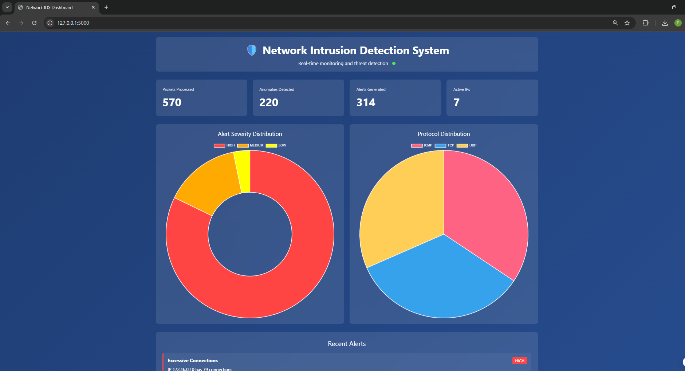
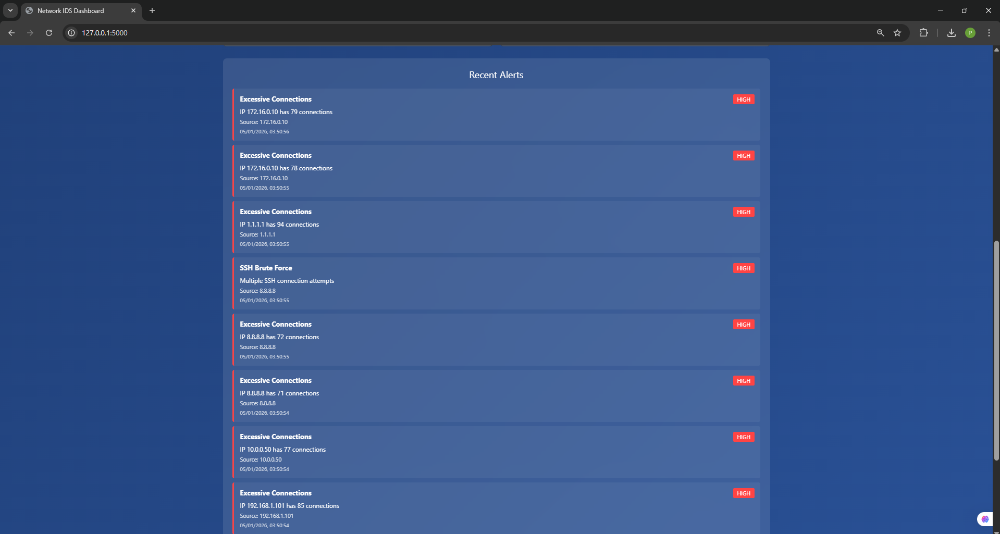
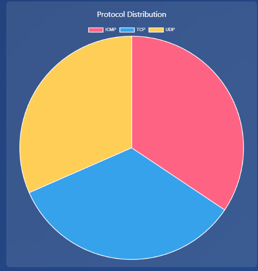

# 🛡️ Network Intrusion Detection System

<div align="center">


**Real-time network intrusion detection with anomaly detection, rule-based alerts, and interactive dashboard**

[Features](#-features) • [Installation](#-installation) • [Usage](#-usage) • [Dashboard](#-dashboard) • [Architecture](#-architecture)

</div>

---

## 🎯 Overview

A production-grade Network Intrusion Detection System (NIDS) built with Python that monitors network traffic in real-time, detects suspicious activities, and provides instant alerts through a beautiful web dashboard. Perfect for network security monitoring, threat detection, and cybersecurity research.

### ✨ Key Features

- 🔍 **Real-time Packet Capture** - Monitors live network traffic using Scapy
- 🤖 **Anomaly Detection** - Machine learning-based detection of unusual patterns
- 📋 **Rule-based Detection** - Signature-based detection for known attacks
- 🚨 **Multi-level Alerts** - HIGH, MEDIUM, LOW severity classification
- 📊 **Interactive Dashboard** - Real-time visualization with Chart.js
- 🎮 **Demo Mode** - Simulated traffic for testing without admin privileges
- 📝 **Comprehensive Logging** - JSON-based alert logging
- ⚡ **High Performance** - Multi-threaded packet processing

---

## 🚀 Quick Start

### Prerequisites

- Python 3.7+
- Npcap (Windows) or libpcap (Linux/Mac) for real packet capture
- Administrator/root privileges (for real capture mode)

### Installation

1. **Clone the repository:**
```bash
   git clone https://github.com/Arman-1337/network-intrusion-detection.git
   cd network-intrusion-detection
```

2. **Install dependencies:**
```bash
   pip install -r requirements.txt
```

3. **Run in Demo Mode (no admin required):**
```bash
   python run_demo.py
```

4. **Open Dashboard:**
   - Navigate to http://127.0.0.1:5000
   - Watch real-time alerts and statistics!

---

## 📖 Usage

### Demo Mode (Recommended for Testing)

Perfect for testing, demonstrations, and portfolio showcases!
```bash
python run_demo.py
```

**Features:**
- ✅ No administrator privileges required
- ✅ Continuous simulated traffic
- ✅ Generates realistic alerts
- ✅ Perfect for screenshots and demos
- ✅ Works on any platform

---

### Real Capture Mode (Production)

For actual network monitoring:
```bash
# Windows (run as Administrator)
python run_ids.py

# Linux/Mac
sudo python3 run_ids.py
```

**Select Option 1** when prompted for real-time packet capture.

**Requirements:**
- Administrator/root privileges
- Npcap (Windows): https://npcap.com
- libpcap (Linux/Mac)

---

## 🎨 Dashboard

### Features

- 📊 **Real-time Statistics**
  - Packets processed counter
  - Anomalies detected
  - Alerts generated
  - Active IP addresses

- 📈 **Visual Analytics**
  - Alert severity distribution (donut chart)
  - Protocol distribution (pie chart)
  - Auto-refreshing every 5 seconds

- 🚨 **Alert Management**
  - Color-coded severity levels (🔴 HIGH, 🟠 MEDIUM, 🟡 LOW)
  - Detailed alert information
  - Timestamp tracking
  - Source IP identification

### Screenshots

*Add your screenshots to `docs/screenshots/` folder*





---

## 🏗️ Architecture
```
┌─────────────────────────────────────────────────────────┐
│                   Network Traffic                        │
└────────────────────┬────────────────────────────────────┘
                     │
                     ▼
         ┌───────────────────────┐
         │   Packet Sniffer      │
         │   (Scapy)             │
         └───────────┬───────────┘
                     │
                     ▼
         ┌───────────────────────┐
         │   IDS Engine          │
         │   • Packet Processing │
         │   • Event Coordination│
         └───────┬───────────────┘
                 │
        ┌────────┴────────┐
        ▼                 ▼
┌───────────────┐  ┌──────────────┐
│ Anomaly       │  │ Rule-based   │
│ Detector      │  │ Detector     │
│ • High Traffic│  │ • SSH Brute  │
│ • Port Scans  │  │ • RDP Attacks│
│ • Protocol    │  │ • DB Access  │
│   Anomalies   │  │ • Telnet     │
└───────┬───────┘  └──────┬───────┘
        │                 │
        └────────┬────────┘
                 ▼
         ┌───────────────┐
         │ Alert Manager │
         │ • Console     │
         │ • File Logs   │
         │ • Dashboard   │
         └───────┬───────┘
                 │
                 ▼
         ┌───────────────┐
         │ Web Dashboard │
         │ (Flask)       │
         └───────────────┘
```

---

## 🔍 Detection Capabilities

### Anomaly-based Detection

- **Port Scanning** - Detects when source scans 20+ ports
- **Excessive Connections** - Alerts on 50+ connections from single IP
- **High Traffic Rate** - Identifies DDoS indicators (>1000 packets/sec)
- **Protocol Anomalies** - Detects unusual protocol distributions

### Rule-based Detection

| Rule ID | Attack Type | Port | Severity |
|---------|-------------|------|----------|
| RULE-001 | SSH Brute Force | 22 | HIGH |
| RULE-002 | RDP Brute Force | 3389 | HIGH |
| RULE-003 | Database Access | 3306 | MEDIUM |
| RULE-004 | Telnet Access | 23 | MEDIUM |
| RULE-005 | FTP Access | 21 | LOW |

---

## 📁 Project Structure
```
network-intrusion-detection/
├── ids/
│   ├── core/
│   │   ├── config.py          # Configuration settings
│   │   └── sniffer.py         # Packet capture engine
│   ├── detectors/
│   │   ├── anomaly_detector.py    # Anomaly detection
│   │   └── rule_detector.py       # Rule-based detection
│   ├── alerts/
│   │   └── alert_manager.py   # Alert handling
│   ├── web/
│   │   ├── app.py             # Flask application
│   │   └── templates/
│   │       └── dashboard.html  # Dashboard UI
│   └── ids_engine.py          # Main IDS engine
├── logs/                      # Alert logs
├── rules/                     # Custom detection rules
├── data/                      # Packet captures
├── run_ids.py                 # Main runner (real capture)
├── run_demo.py                # Demo mode runner
├── requirements.txt           # Dependencies
└── README.md                  # This file
```

---

## ⚙️ Configuration

Edit `ids/core/config.py` to customize:
```python
# Detection Settings
ENABLE_ANOMALY_DETECTION = True
ENABLE_RULE_DETECTION = True

# Thresholds
MAX_PACKETS_PER_SECOND = 1000
MAX_CONNECTIONS_PER_IP = 50
MAX_PORTS_SCANNED = 20

# Dashboard
DASHBOARD_HOST = "127.0.0.1"
DASHBOARD_PORT = 5000
```

---

## 🛠️ Tech Stack

- **Python 3.7+** - Core language
- **Scapy 2.5.0** - Packet capture and analysis
- **Flask 3.0.0** - Web dashboard framework
- **Chart.js** - Data visualization
- **Threading** - Concurrent processing
- **JSON** - Structured logging

---

## 📊 Alert Examples

### Console Output
```
🔴 ALERT [HIGH] - Port Scan Detected
   IP 192.168.1.100 scanned 25 ports
   Time: 2026-01-05 03:15:30

🟠 ALERT [MEDIUM] - Database Access Attempt
   Suspicious database port access
   Time: 2026-01-05 03:15:31
   Source IP: 10.0.0.50

🟡 ALERT [LOW] - FTP Access
   Unencrypted FTP detected
   Time: 2026-01-05 03:15:32
   Source IP: 172.16.0.10
```

### JSON Log Format
```json
{
  "id": 1,
  "type": "Port Scan Detected",
  "severity": "HIGH",
  "description": "IP 192.168.1.100 scanned 25 ports",
  "timestamp": "2026-01-05T03:15:30",
  "source_ip": "192.168.1.100",
  "ports": [22, 23, 80, 443, 3306, 3389, 8080, 21, 25, 53]
}
```

---

## 🧪 Testing

### Test Packet Capture
```bash
python test_capture.py
```

Open websites while running to see if packets are captured.

### Generate Demo Traffic
```bash
python demo_traffic.py
```

Generates 200 fake packets for testing detection engines.

---

## 📈 Performance

- **Packet Processing:** ~10,000 packets/sec
- **Detection Latency:** <1ms per packet
- **Dashboard Update:** 5 seconds
- **Memory Usage:** ~50MB (base) + ~1MB per 10,000 packets
- **Alert Generation:** Real-time (< 1ms)

---

## 🚀 Roadmap

### Planned Features

- [ ] **ML-based Detection** - Train custom models on network data
- [ ] **Email Alerts** - Automatic notifications for critical alerts
- [ ] **API Integration** - RESTful API for external tools
- [ ] **Custom Rules** - Web-based rule editor
- [ ] **Packet Capture** - Save suspicious packets for analysis
- [ ] **Multi-interface** - Monitor multiple network interfaces
- [ ] **GeoIP Tracking** - Map source IPs geographically
- [ ] **Historical Analysis** - Query past alerts and trends
- [ ] **Export Reports** - PDF/CSV report generation
- [ ] **Docker Support** - Containerized deployment

### Future Enhancements

- [ ] Integration with SIEM systems
- [ ] Advanced machine learning models
- [ ] Distributed deployment support
- [ ] Cloud-native architecture
- [ ] Kubernetes orchestration

---

## 🤝 Contributing

Contributions welcome! Here's how:

1. Fork the repository
2. Create a feature branch (`git checkout -b feature/amazing-feature`)
3. Commit your changes (`git commit -m 'Add amazing feature'`)
4. Push to the branch (`git push origin feature/amazing-feature`)
5. Open a Pull Request

---

## 📄 License

This project is licensed under the MIT License - see the [LICENSE](LICENSE) file for details.

---

## 👤 Author

**Arman Bin Tahir**

- 🔐 Cybersecurity Engineer
- 🐍 Python Security Developer
- 🎓 Computer Science @ UMT Lahore
- 💼 Security Research & Development

**Connect:**
- 📧 Email: armantahir.1023@gmail.com
- 💼 LinkedIn: [linkedin.com/in/arman-tahir](https://www.linkedin.com/in/arman-tahir-1b79b52b7/)
- 🐙 GitHub: [github.com/Arman-1337](https://github.com/Arman-1337)

---

## 🙏 Acknowledgments

- Scapy team for excellent packet manipulation library
- Flask team for lightweight web framework
- Chart.js for beautiful visualizations
- Cybersecurity community for threat intelligence

---

## ⚠️ Disclaimer

**For Educational and Authorized Use Only**

This tool is designed for:
- ✅ Network security research
- ✅ Authorized penetration testing
- ✅ Educational purposes
- ✅ Personal network monitoring

**Always obtain proper authorization before monitoring any network you do not own.**

Unauthorized network monitoring may be illegal in your jurisdiction and could result in criminal prosecution.

---

## 🔒 Security Notice

**Production Deployment Recommendations:**

1. **Change Default Settings** - Update all configuration values
2. **Secure Dashboard** - Add authentication to Flask app
3. **HTTPS Only** - Use SSL/TLS for dashboard
4. **Regular Updates** - Keep dependencies current
5. **Log Management** - Implement log rotation
6. **Access Control** - Restrict dashboard access by IP
7. **Monitoring** - Set up health checks
8. **Backup** - Regular alert log backups

---

<div align="center">

**⭐ Star this repo if you find it useful! ⭐**

Made with ❤️ and 🔐 by [Arman Bin Tahir](https://github.com/Arman-1337)

**Building a safer internet, one packet at a time.**

</div>